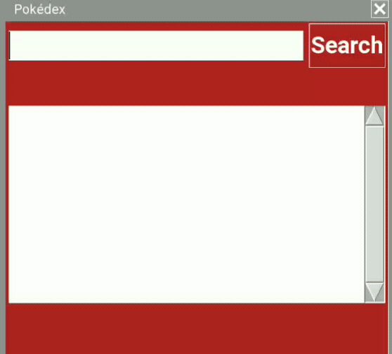
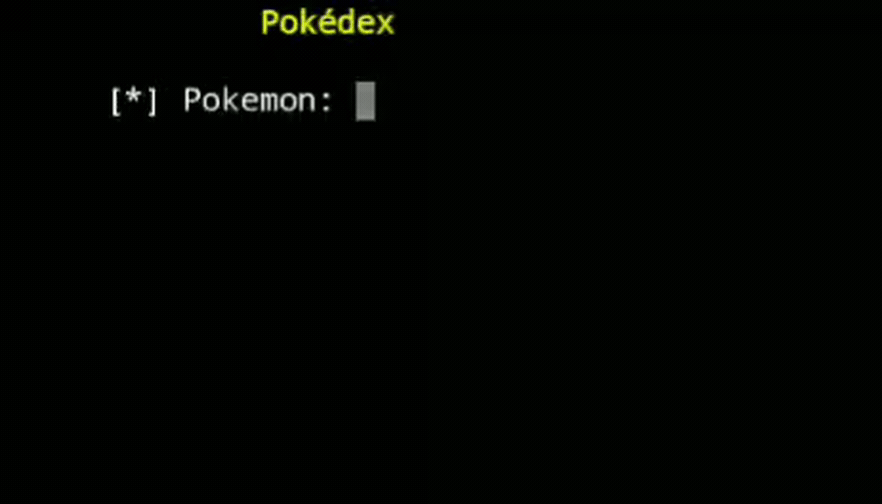

# Pokédex
A "Pokédex" using api [PokeApi](https://pokeapi.co/).

## Requirements (interface)
Type the following commands into the terminal:

```
pip install PySimpleGUI
pip install requests
```
## Requirements (no interface)
Type the following commands into the terminal:

```
pip install requests
```
## Pokédex interface ( Very simple interface )


## Pokédex normal (text mode)


## Technology


___
_Created By me (Rodrigo-s3nsh1)_
